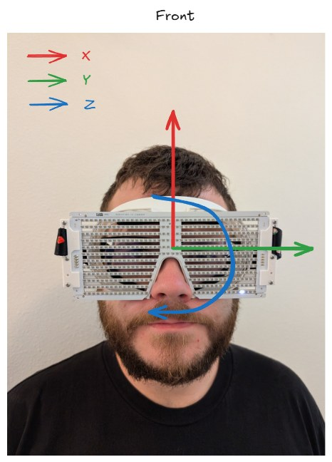
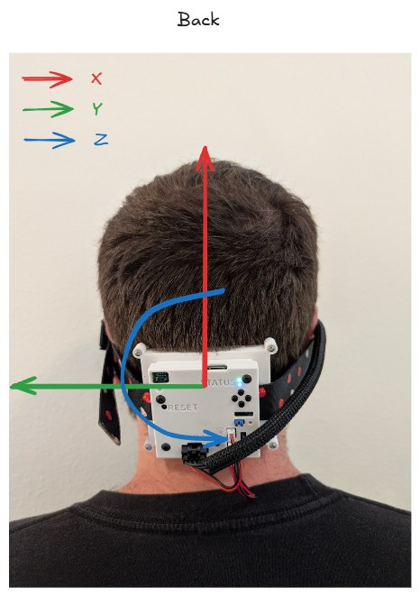
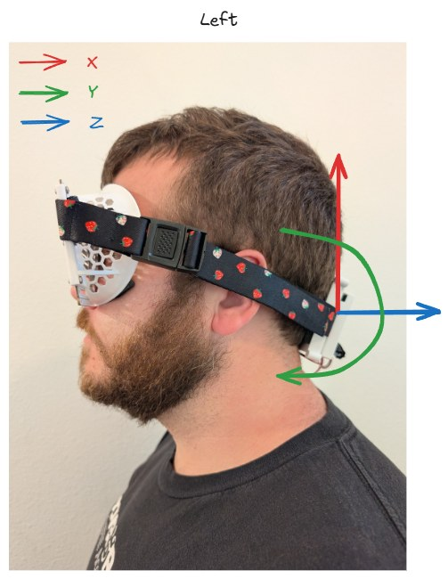
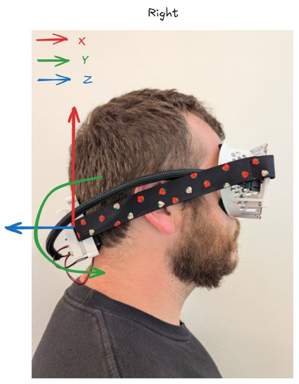
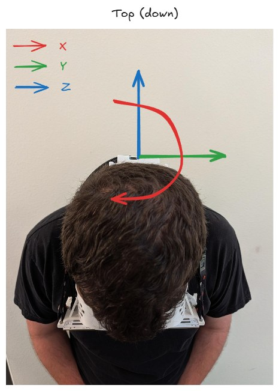
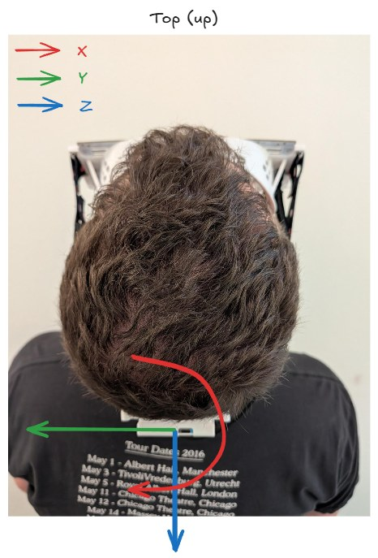

# IMU Coordinate Frame (Proto0)

Proto0 carries a **Bosch BMI270** 6-axis IMU (3-axis accelerometer + 3-axis
gyroscope) on SPI. See `fw/docs/proto0-board-pinout.md` for its pin assignments
and `fw/src/imu/imu.cpp` for the driver integration (samples both accel and gyro
at 25 Hz off the BMI270 data-ready interrupt).

## The frame is the raw chip frame

The BMI270 devicetree node
(`fw/boards/others/rgb_sunglasses_proto0/rgb_sunglasses_proto0_nrf5340_cpuapp_common.dts`)
has **no `mount-matrix` and no rotation** applied. The firmware therefore
consumes the sensor's axes **exactly as the part is soldered on the board** —
`accel[0]`/`gyro[0]` is the chip's physical +X, and so on. There is no software
remap anywhere in the pipeline, so **these photos are the authoritative
description of what each axis means on the wearer's head.** If a future board
revision rotates the part, either add a `mount-matrix` to the devicetree or
update this document (and the images).

## Axes as worn

Coordinates are given for the glasses **worn normally, head upright and level**.

| Axis        | Points toward…            | Anatomical | Rotation about it (gyro) |
| ----------- | ------------------------- | ---------- | ------------------------ |
| **+X** (red)   | the crown / straight up   | superior   | **yaw** — turning the head left/right ("no") |
| **+Y** (green) | out the **left** temple   | wearer's left | **pitch** — nodding up/down ("yes") |
| **+Z** (blue)  | out the **back** of the head | posterior | **roll** — bringing an ear toward a shoulder |

This is a **right-handed** triad (X × Y = Z). Gyro output for each axis is the
angular rate about the corresponding accelerometer axis, positive per the
right-hand rule. The gyro *polarity* (which physical rotation direction reads
positive) has not been bench-verified here — confirm on-device before relying on
a specific sign.

### Annotated views

In every photo the same triad is drawn — red = X, green = Y, blue = Z. The
**straight** arrow(s) lie in the image plane; the **curved** arrow is the axis
pointing roughly along the camera direction (toward or away from the viewer),
drawn as an arc because it would otherwise be foreshortened to a dot.

Front — facing the wearer:

Back — behind the wearer, showing the rear electronics module:

Left side of the wearer:

Right side of the wearer:

Top-down — looking down at the crown, eyes at the bottom of the frame pointing at
the floor:

Top-up — the same top view with the head tipped back the other way:

