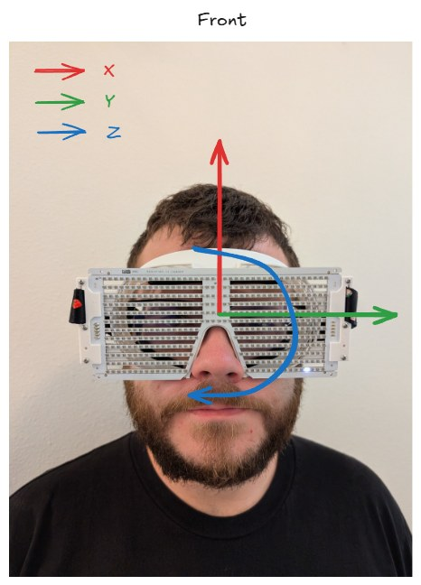
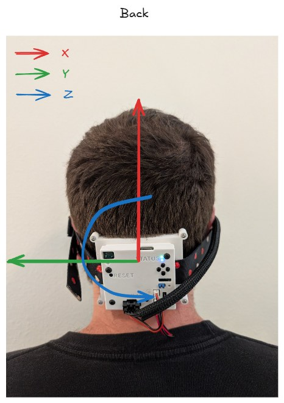
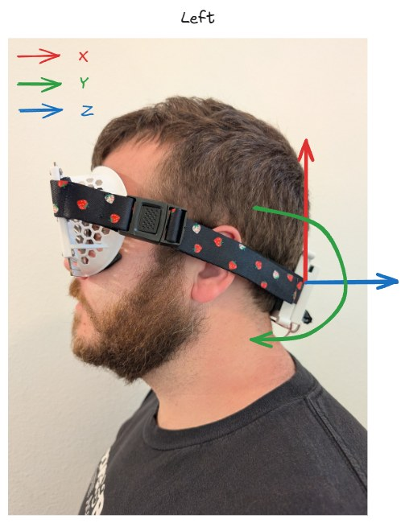
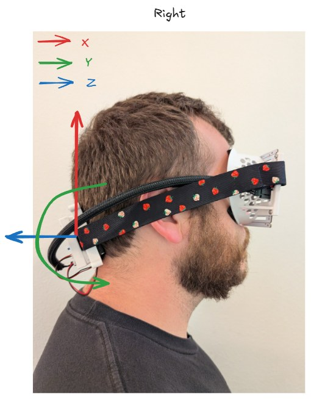
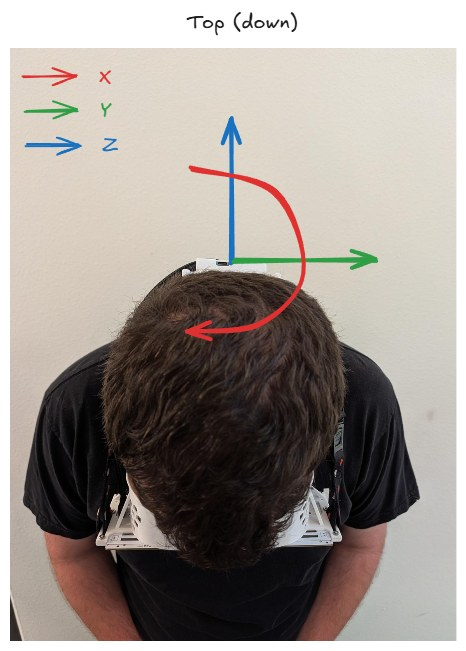
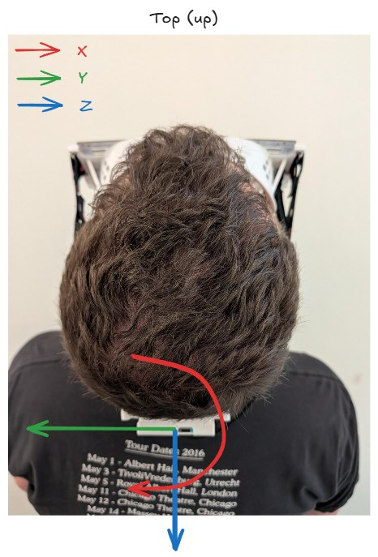

# IMU Coordinate Frame (Proto0)

Proto0 carries a **Bosch BMI270** 6-axis IMU (3-axis accelerometer + 3-axis
gyroscope) on SPI. See `fw/docs/proto0-board-pinout.md` for its pin assignments
and `fw/src/imu/imu.cpp` for the driver integration (samples both accel and gyro
at 25 Hz off the BMI270 data-ready interrupt).

## The frame is the raw chip frame

The BMI270 devicetree node
(`fw/boards/others/rgb_sunglasses_proto0/rgb_sunglasses_proto0_nrf5340_cpuapp_common.dts`)
has **no `mount-matrix` and no rotation** applied. The firmware therefore
consumes the sensor's axes **exactly as the part is soldered on the board** —
`accel[0]`/`gyro[0]` is the chip's physical +X, and so on. There is no software
remap anywhere in the pipeline, so **these photos are the authoritative
description of what each axis means on the wearer's head.** If a future board
revision rotates the part, either add a `mount-matrix` to the devicetree or
update this document (and the images).

## Axes as worn

Coordinates are given for the glasses **worn normally, head upright and level**.

| Axis        | Points toward…            | Anatomical | Rotation about it (gyro) |
| ----------- | ------------------------- | ---------- | ------------------------ |
| **+X** (red)   | the crown / straight up   | superior   | **yaw** — "no". Positive = turning **left** |
| **+Y** (green) | out the **left** temple   | wearer's left | **pitch** — "yes". Positive = nose **down** |
| **+Z** (blue)  | out the **back** of the head | posterior | **roll** — ear to shoulder. Positive = crown tips **left** |

This is a **right-handed** triad (X × Y = Z). Gyro output for each axis is the
angular rate about the corresponding accelerometer axis, positive per the
right-hand rule.

### Annotated views

In every photo the same triad is drawn — red = X, green = Y, blue = Z. The
**straight** arrow(s) lie in the image plane; the **curved** arrow is the axis
pointing roughly along the camera direction (toward or away from the viewer),
drawn as an arc because it would otherwise be foreshortened to a dot.

Front — facing the wearer:

Back — behind the wearer, showing the rear electronics module:

Left side of the wearer:

Right side of the wearer:

Top-down — looking down at the crown, eyes at the bottom of the frame pointing at
the floor:

Top-up — the same top view with the head tipped back the other way:

## Bench verification

Both the accelerometer frame and the gyro polarity were verified on Proto0
hardware (2026-08-24, fw v3.4.0-stable) with the on-device capture path —
`capture start <seconds>`, whose `.csv` sidecar logs raw `ax,ay,az,gx,gy,gz` at
25 Hz. The axis directions above are measured, not inferred.

**Accelerometer.** The glasses were held stationary in six orientations; the axis
pointing up reads +1 g. Every reading matched the table (m/s²):

| Orientation (as worn) | ax | ay | az |
| --------------------- | ------ | ------ | ------ |
| Upright, level        | **+9.95** | +0.83 | −0.01 |
| Upside down           | **−9.61** | −0.49 | −0.72 |
| Right temple down     | −0.10 | **+9.78** | −0.14 |
| Left temple down      | −0.18 | **−9.84** | −0.52 |
| Face down             | +0.01 | +0.21 | **+9.87** |
| Face up               | +0.29 | −0.19 | **−9.84** |

Off-axis terms are hand-held pose error (≤ 6°); every vector magnitude fell in
9.65–9.98 m/s², i.e. 1.00 g.

**Gyroscope.** Measured directly by sweeping briskly in the named direction and
returning slowly: `gx` peaked +6.6…+8.2 rad/s on left yaws, `gy` +10.6…+13.9 on
nose-down pitches, `gz` +5.4…+6.6 on left rolls — each with the slow return
reading the opposite sign.

That result depends on the operator having swept the intended way, so it was
cross-checked independently. For a rigid body a fixed world vector obeys
`d(a)/dt = −ω × a`, so the accelerometer's own gravity reading predicts what the
gyro must report. Over well-conditioned samples (rate low enough for a central
difference at 25 Hz, and ω not parallel to gravity) the measured and predicted
derivatives agreed with median cosine similarity 0.92 (X), 0.91 (Y), 0.89 (Z).
The gyro triad is therefore right-handed with respect to the accelerometer axes,
which pins the polarity by the right-hand rule regardless of how the motions were
performed.

Note that yaw performed with the head upright puts ω parallel to gravity, where
`ω × a = 0` and this cross-check carries **no** information about X — the X figure
above comes from rotations taken while the crown axis was off-vertical. A repeat
of this exercise should include at least one X-axis rotation with the glasses
tipped, or it will silently fail to test that axis.
