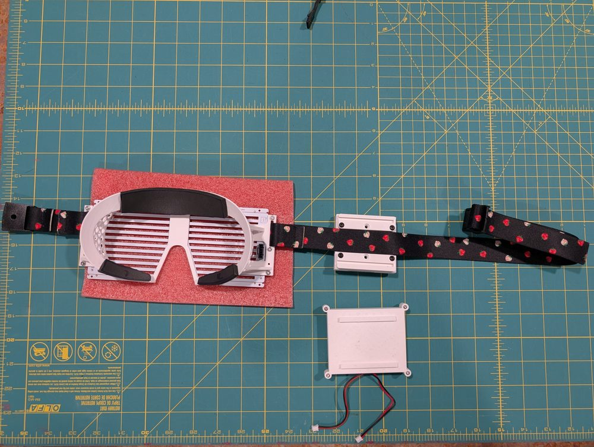
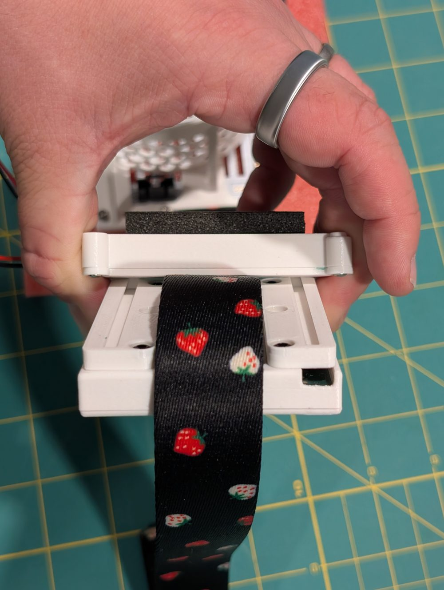
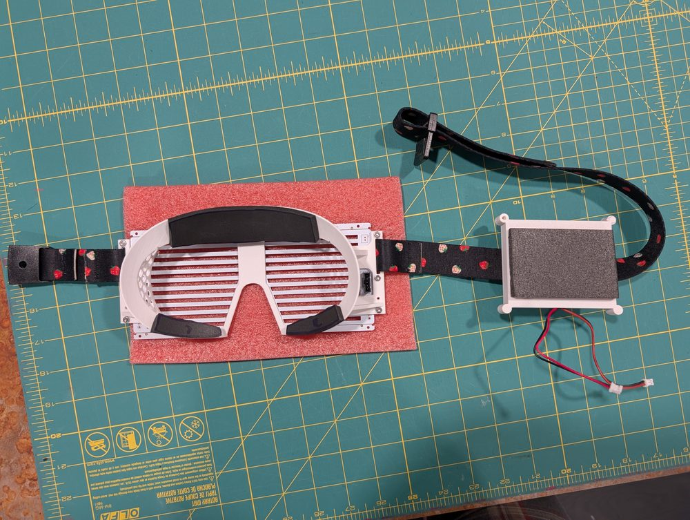
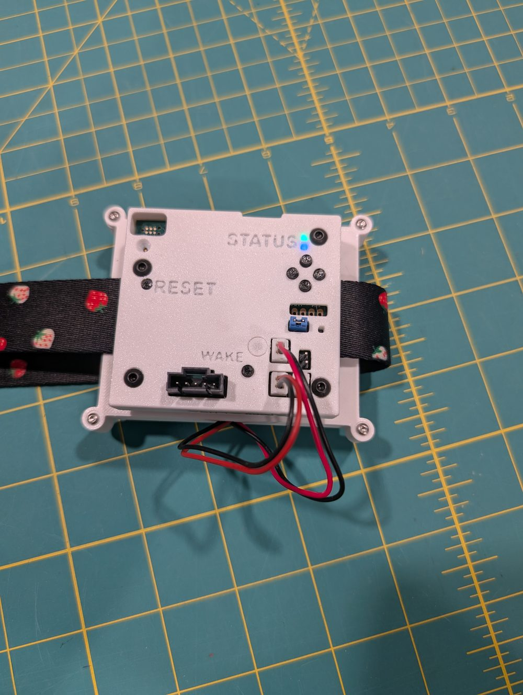
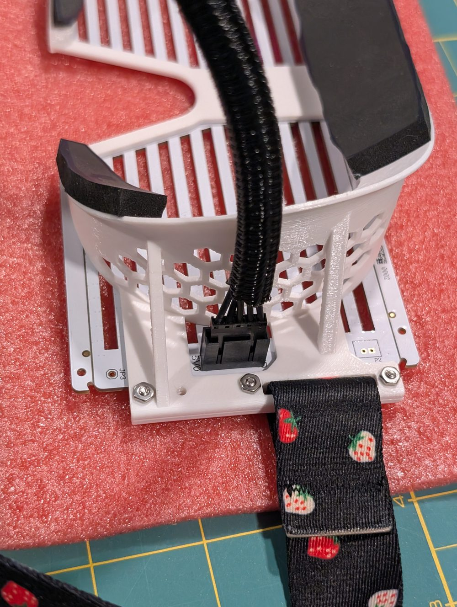
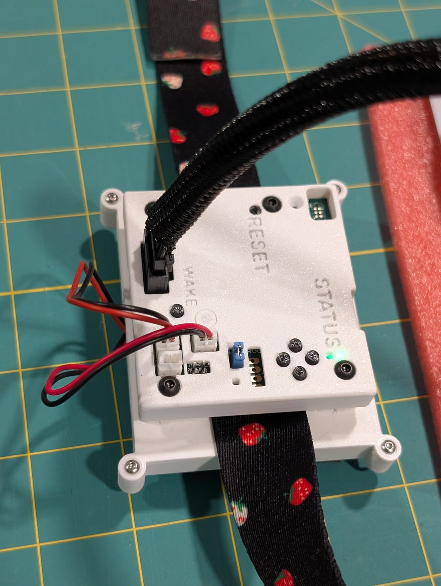
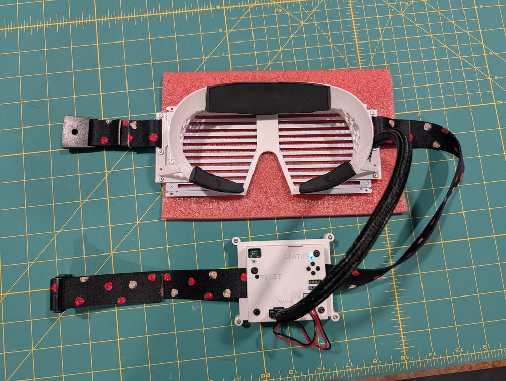

# Proto0 Assembly Guide

This guide walks through assembling your Proto0 glasses — mounting the Compute Pack
and a battery pack onto the head strap and connecting everything up.

New to the hardware? Read the [Proto0 User Guide](/proto0-user-guide) first — it
covers what's in the kit, the buttons and status LEDs, and safety notes.

The Compute Pack and a battery pack clip together on the glasses' head strap: the
Compute Pack has trapezoidal grooves on its back that mate with matching rails on
each battery case. The battery case slides onto those rails, sandwiching the strap
between the two.

> **Before you start:** disconnect USB power and any battery before connecting or
> disconnecting the Glasses LED Panel — see the safety notes in the
> [Proto0 User Guide](/proto0-user-guide#important-proto0-hardware-notes).

## 1. Lay out the parts

Set out the glasses (with the head strap fitted), a battery pack, and the compute
pack. Lay the strap between the compute pack's mounting rails as shown.

## 2. Slide the battery pack onto the rails

Slide the battery pack onto the matching rails of the compute pack. The strap
should be enclosed between the battery pack and the compute pack as shown, with room
to slide.

## 3. Center the battery pack

Finish sliding the battery pack onto the compute pack until it's centered on the
compute pack. The rails have end-stops that will bottom out when they are aligned
correctly.

## 4. Connect the battery cables

Turn the compute pack over and connect the battery cables.

## 5. Connect the LED panel cable to the glasses

Connect one end of a Glasses LED Panel cable to the connector on the back of the
glasses frame.

## 6. Connect the LED panel cable to the compute pack

Connect the other end of the Glasses LED Panel cable into the compute pack.

Your glasses are now assembled and ready to wear.

## Cable lengths

Three Glasses LED Panel cables are included, in short, medium, and long lengths.
**All three lengths work** — use whichever suits your setup:

- The **medium** length is intended for use on the glasses **while being worn**.
- The other lengths are convenient for benchtop development and other setups.

## Battery extension cables

The kit includes **battery extension cables** so a battery pack can be routed away
from the Compute Pack — for example, mounted further back on the head strap or
tucked into a pocket while the glasses are worn. A variant with an **inline switch**
is also included, letting you cut battery power without unplugging anything.

## Next steps

- Power on and pair over Bluetooth — see
  [Proto0 User Guide → Bluetooth Pairing](/proto0-user-guide#bluetooth-pairing-first-time).
- Charge and manage the battery — see
  [Proto0 User Guide → Batteries and charging](/proto0-user-guide#batteries-and-charging).
