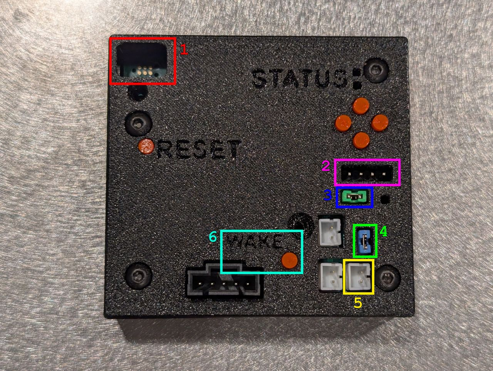

# Proto0 Hardware Hacker's Guide

This page describes nitty-gritty hardware details about the Proto0 hardware.

**You probably want the [Proto0 User Guide](/proto0-user-guide) instead!**

## Hardware Overview

1. (Red) JTAG connector. Compatible with [TagConnect TC2030-IDC-NL](https://www.tag-connect.com/product/tc2030-idc-nl).
2. (Purple) UART connector. Available for emergency debugging / bootloader debugging but requires DeviceTree changes to enable. Currently disabled.
3. (Blue) Charger programming jumper. Connects the appropriate resistance to configure the charger for 2S LiPo charging on power-up. **The jumper configuration is now standard across all Proto0 units** — do not remove it.
4. (Green) Charger thermal-override jumper. Intended to connect a dummy resistance to the battery charger to mimic a thermistor. **This jumper is non-functional on most units.** The firmware works around this by overriding the charger's NTC thermal check in software at startup (`bq25792_temp_override()` in `src/power.cpp`; no thermistor is fitted on Proto0), so thermal management does not depend on this jumper.
5. (Yellow) Thermistor connector. Allows connecting an NTC thermistor to the battery charger. Unused on Proto0 (see note 4).
6. (Cyan) Wake button. Intended to wake the battery charger + MCU from sleep. **Non-functional on Proto0** — it is a known hardware defect (the WAKE_N line, shared with the charger's /QON, reads stuck-low and caused a GPIO interrupt storm), so the wake-button handler is disabled in firmware (`CONFIG_APP_WAKE_BUTTON=n`).

## JTAG

JTAG is exposed via a TagConnect TC2030 interface. To connect to JTAG, you'll require
the following hardware from TagConnect:

- [TagConnect TC2030-IDC-NL](https://www.tag-connect.com/product/tc2030-idc-nl): the cable that connects to the board. There are variants of this cable for different JTAG hardware; this is the one that I use. **Note that this is the no-legs variant!**
  - The Proto0 hardware does not have holes drilled for the TagConnect "legs". You must use the "no-legs" variant of any TagConnect 2030 cable!
- [TC2030-CLIP-3PACK retaining clip](https://www.tag-connect.com/product/tc2030-retaining-clip-board-3-pack): a small PCB with embedded studs that attaches the TagConnect JTAG cable to the PCB using friction. **Technically optional, but extremely highly recommended if you plan on using JTAG for development.** Without this part, you have to physically press the JTAG connector onto the PCB each time you program.
- [ARM20-CTX 20-pin to TC2030-IDC adapter for Cortex](https://www.tag-connect.com/product/arm20-ctx-20-pin-to-tc2030-idc-adapter-for-cortex): adapter that allows attaching the TC2030-IDC cable to a standard JTAG probe 20-pin connector (e.g. SEGGER, Lauterbach).
