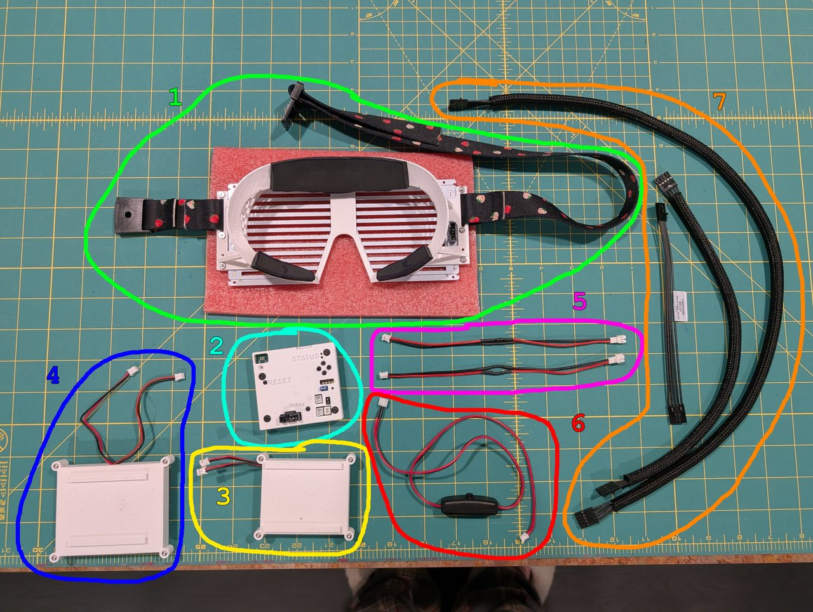
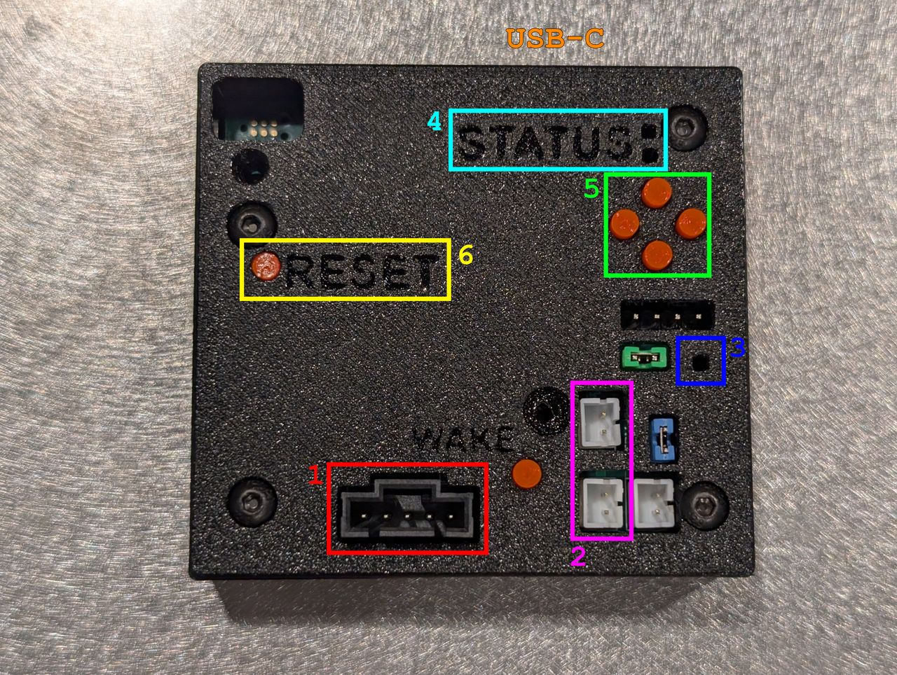
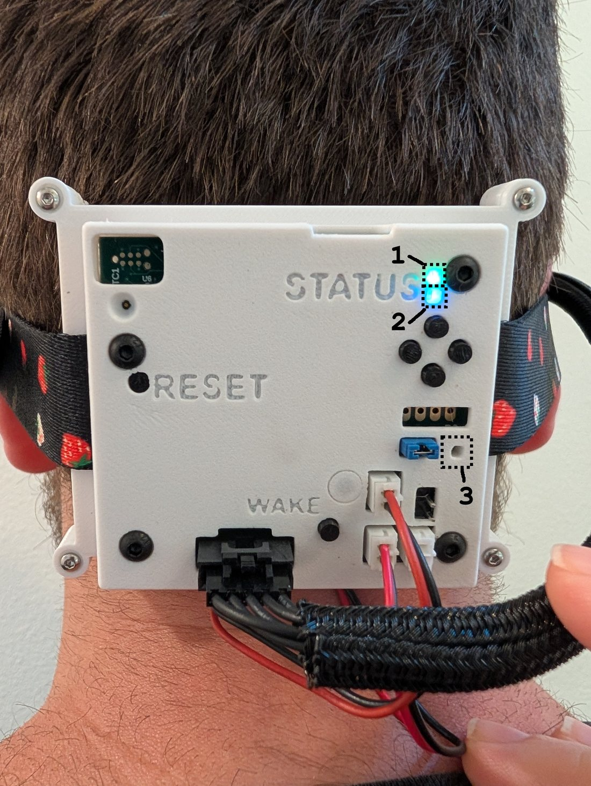
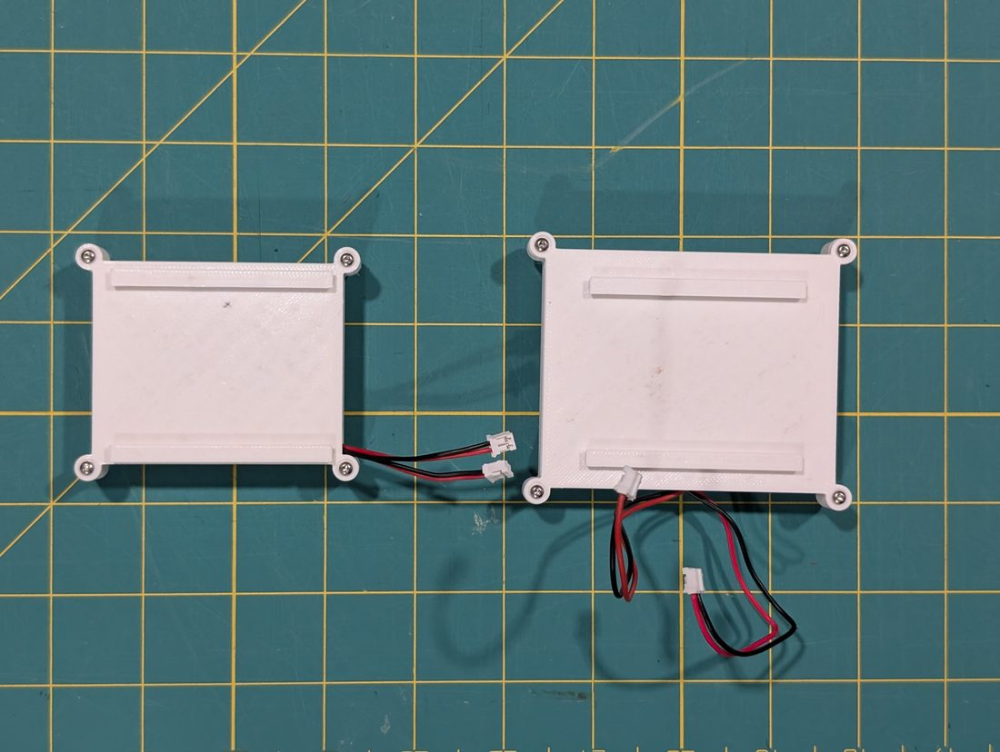
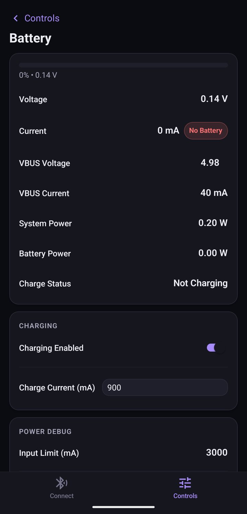
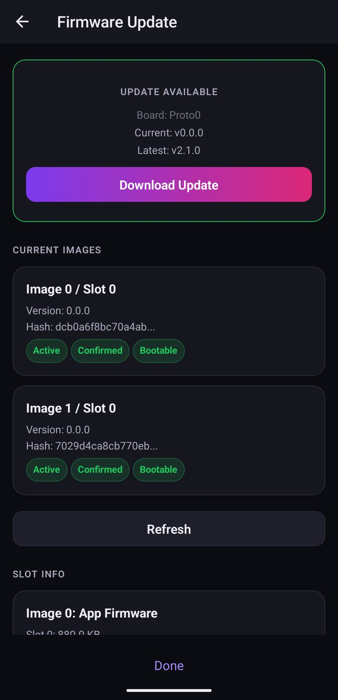
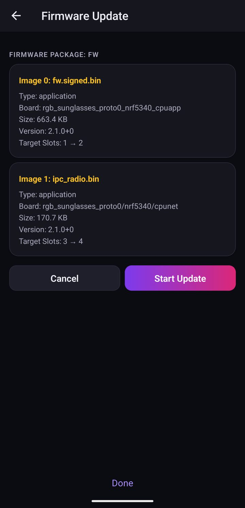
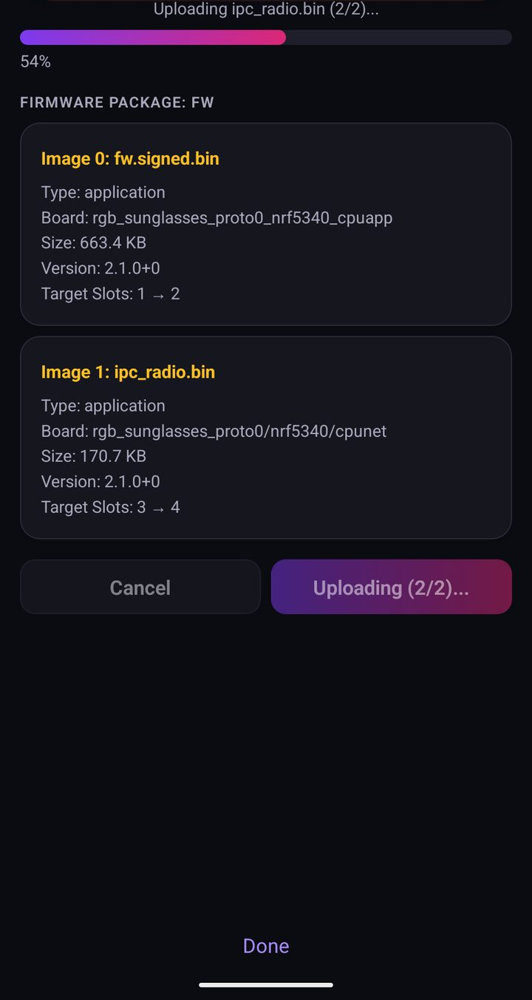
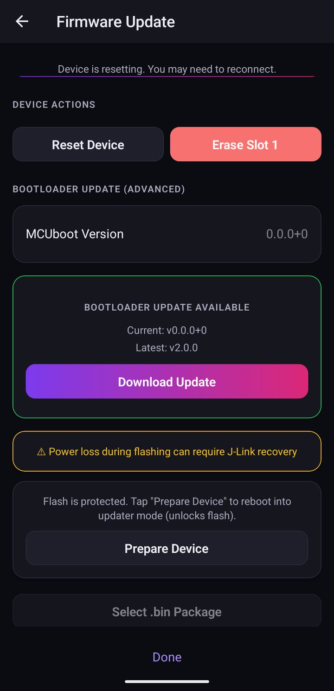

# Proto0 User Guide

This guide introduces you to the RGB Sunglasses **Proto0** hardware.

Please read this entire page before working with Proto0! Proto0 is early
prototype hardware — it is hand-assembled, not mass-produced, and cannot be
easily replaced. This guide will help you work with the hardware safely.

## What's in a Proto0 kit

A Proto0 kit contains:

1. **Glasses** — the wearable frame with the RGB LED panel and head strap.
2. **Compute Pack** — the nRF5340-based controller, installed in a case, with the
   buttons, status LEDs, and USB-C port.
3. **Small battery pack** — 2× 900 mAh lithium-polymer cells. See
   [Batteries and charging](#batteries-and-charging).
4. **Big battery pack** — 2× 2000 mAh lithium-polymer cells. See
   [Batteries and charging](#batteries-and-charging).
5. **Battery extension cables** — for routing a battery pack away from the Compute
   Pack. See [Battery extension cables](/proto0-assembly-guide#battery-extension-cables).
6. **Battery extension cable with an inline switch** — cut battery power without
   unplugging.
7. **Glasses LED Panel cables** — three lengths (short, medium, long). All work;
   see [Cable lengths](/proto0-assembly-guide#cable-lengths) for which to use.

You will also need a **USB-C cable** to power and charge the Compute Pack.

## Hardware Overview

1. (Red) — Glasses LED Panel Connector: a Molex 2.54 mm SL 5-pin connector to attach to the glasses LED panel.
2. (Purple) — Battery Connectors (2×): JST PH connectors for the 2× lithium-polymer cells in the battery pack.
3. (Blue) — Battery Charger Status LED: a simple LED driven directly by the BQ25792 battery charger, separate from the firmware-driven System Status LEDs below. **Solid** = charging; **flashing** = charge error; **off** = not charging.
4. (Teal) — System Status LEDs: two independently controlled, firmware-driven status LEDs — a **top** LED for **charge status** and a **bottom** LED for **Bluetooth status**. See [Status LEDs](#status-leds).
5. (Green) — D-Pad Buttons: Up, Down, Left and Right. Intended to control animations. Currently, only the GLIM player uses the buttons. The "Left" button can be used to enter DFU mode (see [Firmware Recovery](/recovery)). Holding **Up + Down while booting** triggers a factory reset.
6. (Yellow) — Recessed Reset Button: press this button to reset the MCU if it's stuck.

There is a USB-C port on the side of the case, near the System Status LEDs,
accessible via a cutout.

## Status LEDs

The Compute Pack has two firmware-driven RGB status LEDs next to the **STATUS**
label. The **top** LED (**1** below) shows **charge / power status** and the
**bottom** LED (**2**) shows **boot and Bluetooth status**. Each LED can be off,
solid, blinking (1 Hz), or "breathing" (a smooth fade — slow or fast). A third,
separate LED (**3**) is driven directly by the battery charger — see the
[Battery Charger Status LED](#hardware-overview) in the Hardware Overview.

### Top LED — Charge / power status

While charging, the color indicates the battery's approximate state of charge
(red → orange → yellow → green as it fills); while running on battery, the color
indicates the remaining charge (green → orange → red as it drains).

| LED state | Meaning |
| --- | --- |
| **Breathing** (slow fade), color by charge level | Charging — trickle / pre-charge phase |
| **Breathing** (fast fade), color by charge level | Charging — fast-charge (constant-current or constant-voltage) phase |
| **Solid green** | Fully charged (top-off / charge complete) |
| **Solid**, color by charge level (green / orange / red) | Running on battery (not charging) |
| **Blinking red** | Battery dead, missing, or disconnected |
| **Blinking orange** | Charger communication error (the charger IC is not responding) |
| **Off** | Not charging and battery level could not be read |

### Bottom LED — Boot & Bluetooth status

| LED state | Meaning |
| --- | --- |
| **Breathing blue** (slow fade) | Advertising — waiting for a phone to connect |
| **Blinking blue** | Connecting, or pairing (a 6-digit passkey is required — see [Bluetooth Pairing](#bluetooth-pairing-first-time)) |
| **Solid blue** | Connected |
| **Breathing violet** (fast fade) | Briefly at boot only — the device is discovering installed animation extensions |

## Important Proto0 Hardware Notes

- There is a third white connector accessible on the Proto0 hardware. It is the same connector type as the battery connectors. **Do not attach a battery to this connector. You will damage the battery charger.** This connector will be plugged on all shipped units to prevent accidental battery connection. **Do not remove the plug.**
- If you disassemble the case, the buttons will fall out. When re-assembling the case, **please note that the reset button pin is shorter than all other button pins to recess it below the case lid**.
- **The jumper configuration is now standard across all Proto0 units.** Do not remove any jumpers installed on the Proto0 — they are critical for operation of the hardware (for example, the charger-programming jumper configures the charger for 2S LiPo charging at power-up). Removing a jumper may result in hardware damage. If you need guidance on re-configuring the hardware, consult @skalldri.

## Battery safety

<h3>⚠️ Never leave the batteries unattended ⚠️</h3>

<strong>Never leave the battery packs plugged in and unattended — whether charging or running.</strong> These are bare lithium-polymer cells. If a cell is damaged, over-charged, or faulty it can overheat, swell, or catch fire. Stay with the glasses whenever a battery is connected, and unplug the packs when you step away.

<ul>
<li><strong>Only</strong> use the battery packs supplied with your Proto0 kit.</li>
<li><strong>Never</strong> charge a pack faster than its rated maximum — set the charge current to match the pack (see <a href="#setting-the-charge-current">Setting the charge current</a>).</li>
<li><strong>Never</strong> connect a battery to the plugged white connector (see <a href="#important-proto0-hardware-notes">Important Proto0 Hardware Notes</a>).</li>
<li><strong>Always</strong> store the battery packs in the included <strong>LiPo safety pouch</strong> when they are not in use.</li>
<li>Stop using a pack immediately if it becomes swollen, hot, damaged, or smells — disconnect it and do not charge it.</li>
</ul>

## Assembling your glasses

The Compute Pack and a battery pack clip together on the glasses' head strap — the
battery case slides onto rails on the back of the Compute Pack, sandwiching the
strap between them. For the full step-by-step with photos, see the
**[Proto0 Assembly Guide](/proto0-assembly-guide)**.

## Unboxing and Setup

When you receive your Proto0 kit, unpack it and identify the parts listed in
[What's in a Proto0 kit](#whats-in-a-proto0-kit).

Connect a Glasses LED cable between the Proto0 Compute Pack's LED Panel connector
and the matching connector on the Glasses LED panel. Pick the length that suits
how you're using the glasses (see [Cable lengths](/proto0-assembly-guide#cable-lengths)).

Connect a USB-C cable between your PC (or a USB power source) and the Proto0
Compute Pack. The glasses will power on within 10 s. The bottom status LED will
breathe blue to indicate the glasses are waiting for a Bluetooth connection (see
[Status LEDs](#status-leds)).

> **Powering the glasses — three options:** the Compute Pack can run
> **standalone on USB power** (no battery required), **standalone on battery power**
> (no USB cable), or **on USB power while charging the batteries at the same time**.
> See [Batteries and charging](#batteries-and-charging).

### Bluetooth Pairing (first time)

A companion app is available for both **Android** and **iOS**. Install the latest
release from
[the Releases page](https://github.com/skalldri/rgb-sunglasses/releases).

Open the app and accept the required permissions to begin Bluetooth scanning. The
Proto0 board should be detected in the companion app. Tap **Connect** to begin the
connection process.

Pin-code pairing is required with the Proto0 board. Your phone will prompt you to
pair with the new device.

- **On Android**, this prompt can appear and disappear quickly. Check the swipe-down
  system notification tray if you don't see it. You may receive two prompts to pair:
  the first will not require a PIN code, and after it a PIN code will be required.
- **On iOS**, the pairing dialog appears as a system alert.

When a PIN code is required, the Glasses LED panel will begin scrolling a **6-digit
PIN code**. Enter this code into the dialog and accept to complete pairing.

After this initial pairing with your phone, you will no longer need to enter a PIN
code to connect to the Proto0 in future.

Once pairing is complete, the device state will be synced with the companion app.
You will be able to start interacting with the app to select animations to play.

## Batteries and charging

Proto0 supports **on-board battery charging**. Connect a USB-C cable to charge the
attached battery pack; the top status LED shows charge progress (see
[Status LEDs](#status-leds)).

### Power sources and charging speed

The Compute Pack charges over its USB-C port and accepts:

- **Standard USB** — 5 V @ 500 mA (**2.5 W**).
- **USB Power Delivery (USB-PD)** — 5 V @ 3 A (**15 W**) or 9 V @ 3 A (**27 W**).

Whenever the Glasses LED panel is connected it draws about **1.2 W continuously**,
even when the display is dark. On a 2.5 W standard USB port, most of that budget goes
to just running the glasses — so the batteries charge **very slowly** on a standard
port.

**For the fastest, most efficient charging, use a 9 V USB Power Delivery charger.**

### Battery packs

Two battery packs are available. Each pack is a **2S** (two-cell series) pack —
its two lithium-polymer cells connect to the two JST-PH battery connectors on the
Compute Pack.

| Pack | Cells | Max charge rate | Recommended charge rate |
| --- | --- | --- | --- |
| **Small** | 2× 900 mAh LiPo | 900 mA | 450 mA |
| **Big** | 2× 2000 mAh LiPo | 2000 mA | 1000 mA |

The higher rate charges faster; the recommended (lower) rate is gentler on the
cells and runs cooler.

### Setting the charge current

The firmware ships with a default charge current of **900 mA** and does **not**
auto-detect which pack is installed, so **set the charge current to match your
pack** before charging:

- With the **Small** pack, do not exceed **900 mA** (450 mA recommended).
- With the **Big** pack, you can use up to **2000 mA** (1000 mA recommended).

You can set the charge current two ways:

- **In the companion app** — open the **Battery** page and set **Charge Current (mA)**
  under **Charging**:

  

- **Over the serial shell** — `power bq ichg <mA>` (see [USB Interface](#usb-interface)).
  Related read-only commands: `power bq status`, `power bq limits`, and
  `power policy`.

Charging is enabled by default, but the charger will only actually charge when a
battery pack is present (charging with no pack attached can brown out the board).

## USB Interface

You can connect the Proto0 hardware to your PC via the USB-C cable. The Proto0
hardware is a composite USB device that exposes several USB endpoints to your PC.

The Proto0 hardware uses Zephyr's default VID:PID `2fe3:0001`.

### Virtual Serial Ports

Proto0 exposes two serial ports to your PC. The exact naming of these serial ports
depends on how your PC enumerates the device. Typically, on Unix-based systems, they
are exposed as `/dev/ttyACM0` and `/dev/ttyACM1`.

- **Shell port** (lower-numbered): Zephyr console. Exposes a shell for development / debugging, as well as application logs.
- **MCUmgr port** (higher-numbered): a non-human-readable binary protocol that speaks MCUmgr. Used for firmware updates.

Both ports are configured for 115200 baud, but given they are virtual ports this
has no effect.

### USB Mass Storage

The Proto0 hardware exposes a small **~6.9 MiB** USB mass-storage device. It is
pre-formatted as a FAT filesystem. **Do not attempt to reformat this disk.**

The filesystem contains a few folders:

- **`ext/`** — loadable animation extensions (`.llext` files) that the firmware runs.
- **`glim/`** — GLIM animation files, read dynamically by the GLIM player. You can
  drop your own `.glim` files here; on the next reboot the GLIM player re-scans the
  folder and exposes any new animations to the companion app.
- **`coredump/`** — firmware crash dumps. Empty unless a crash has produced a dump.

## Firmware Update

The glasses' firmware can be updated a few ways:

- **Over Bluetooth (OTA)** — the easiest for end users; done from the companion app.
  See [Updating over Bluetooth (OTA)](#updating-over-bluetooth-ota) below.
- **Over USB (MCUmgr)** — the fast path for developers. See
  [Developer Setup → Flash the firmware](/developer-setup).
- **Bricked / won't boot?** Recover it over USB with MCUboot's DFU mode — see
  [Firmware Recovery](/recovery).

### Updating over Bluetooth (OTA)

The companion app can install firmware straight from GitHub Releases over
Bluetooth — no cables required. (BLE OTA is slow — expect several minutes; see
[Issue 59](https://github.com/skalldri/rgb-sunglasses/issues/59).)

**1. Open the Firmware Update page.** Connect to your glasses in the app, open the
**Controls** tab, and tap **Firmware Update**. The app checks GitHub for the latest
release and compares it to what's on the device. If a newer version is available, an
**Update Available** card appears.

**2. Download the update.** Tap **Download Update** (or **Select Firmware Package**
to load a `.zip` you already have). The app shows the package contents — the app-core
and network-core images it's about to install.

**3. Start the update.** Tap **Start Update**. The app uploads each image over
Bluetooth, showing a progress bar. Keep the app open and the phone near the glasses
until it finishes.

**4. Reset to finish.** When the upload finishes, tap **Reset Device** to boot into
the new firmware, then reconnect.

